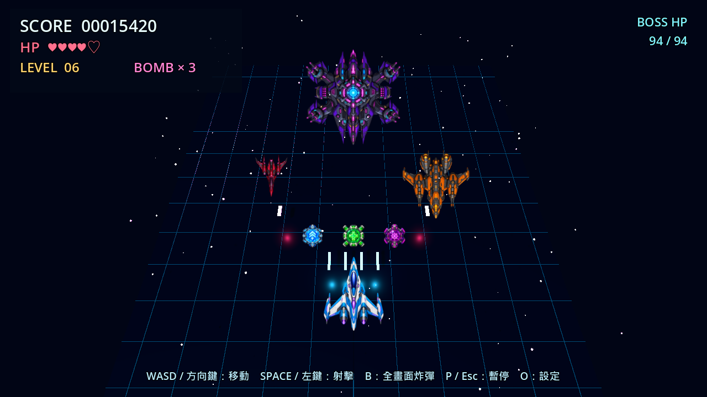

# Thunder Vector 3D — 完整離線 Windows 3D 縱向射擊遊戲

> Godot 4.7.2／GDScript 製作；遊戲執行完全離線。先開啟 `START_CODEX_HERE.md` 可繼續開發，或直接執行 `scripts/start_game.ps1`。



## 下載原始碼

公開專案：<https://github.com/Avery-TSE/thunder-vector-3d>

```powershell
git clone https://github.com/Avery-TSE/thunder-vector-3d.git
cd thunder-vector-3d
.\scripts\start_game.ps1
```

需要先安裝 Godot 4.7.2 Standard。GitHub 頁面的 **Code → Download ZIP**
也能直接下載完整原始碼；`build/` 編譯產物不放進 Git 歷史。

這不是「智譜 API」。本套件使用的是**智慧圖譜／知識圖譜地圖**：`knowledge_graph/knowledge_graph.json` 是專案狀態來源，`smart_graph.png` 與 `smart_graph.svg` 是視覺連結圖。Codex 負責主程式修改，Ollama 地端模型透過 MCP 擔任規劃與審查者。

## 已完成內容

- Godot 4.7.2、GDScript、GL Compatibility、Windows x86_64 的完整可玩來源碼。
- 原創透明 ImageGen 玩家、Scout、Heavy、BOSS 與三種道具主視覺；程序化 3D hull 保留為後備。
- WASD／方向鍵移動、Space／左鍵射擊、B 炸彈、P／Esc 暫停、R／Enter 重開。
- 分數、血量、等級、道具、敵方彈幕、BOSS 戰、音效與 Game Over。
- O 鍵設定選單：主音量、音效、視窗／全螢幕、三種解析度與三段難度，退出後仍會保存。
- 固定容量子彈／敵人物件池，以及 600 秒模擬壓力測試與 F3 診斷顯示。
- 原創透明 PNG、貼圖、8×8 爆炸精靈表、HUD 示意圖與 WAV 音效。
- 自動驗收戰鬥、三種道具、炸彈、BOSS、Game Over／重開、素材 alpha、設定持久化與 15 秒場景 smoke。
- Codex `AGENTS.md`、可貼上的命令、PowerShell 安裝／驗證／打包腳本。
- Ollama MCP Bridge：Codex 可呼叫地端模型規劃、審查檔案與檢查 git diff。
- 智慧圖譜 JSON、Mermaid、DOT、PNG 與 SVG。

## Windows 發行狀態

來源庫不提交編譯產物。安裝官方 Godot 4.7.2 Export Templates 後，執行 `scripts/build_windows.ps1` 會先跑完整驗證，再建立 x86_64 PE、以匯出檔執行 headless／視窗雙 smoke，最後產生白名單 release ZIP。若 Windows 11 Smart App Control 阻擋未簽章的本機開發 EXE，腳本會失敗而不誤報；`-SkipLaunchValidation` 只供明確產生「尚未啟動驗證」的封包，狀態會寫入 `BUILD_INFO.txt`。

## 五分鐘開始

把資料夾解壓到簡短且可寫入的位置，例如：

```text
C:\Dev\ThunderVector3D
```

以一般 PowerShell 開啟該資料夾：

```powershell
Set-ExecutionPolicy -Scope Process Bypass
.\scripts\install_windows.ps1
```

重開 PowerShell，再執行：

```powershell
.\scripts\setup_ai.ps1 -OllamaModel "qwen3.5"
.\scripts\configure_codex_mcp.ps1 -OllamaModel "qwen3.5"
.\scripts\verify.ps1
.\scripts\start_game.ps1 -Editor
```

Godot 開啟後按 **F6 或 F5**。也可直接執行：

```powershell
.\scripts\start_game.ps1
```

Ollama 模型可能很大。硬體不足時，先用 `-SkipModelPull` 完成遊戲與 Codex 安裝，再自行選擇較小的本機模型。`OLLAMA_MODEL` 完全可替換，不影響遊戲執行。

## Codex × 地端模型協作

```powershell
.\scripts\run_codex.ps1
```

進入 Codex 後：

```text
/mcp
```

應看到 `thunder_local`。接著貼上：

```text
讀取 AGENTS.md 與 knowledge_graph/knowledge_graph.json。先用 thunder_local.plan_game_feature 規劃最高優先的未完成節點；我核准前不要修改。
```

核准後讓 Codex修改、執行驗證，再貼上：

```text
把 git diff 交給 thunder_local.review_change；修正所有 BLOCKER，重新驗證，只有在有真實命令結果時才更新智慧圖譜。
```

不使用 MCP 時，也能直接審查 diff：

```powershell
.\scripts\review_diff_local.ps1 -Task "檢查這次物件池修改是否造成射擊或碰撞回歸"
```

## 角色分工

| 角色 | 責任 | 不負責 |
|---|---|---|
| 你／製作人 | 決定玩法、核准範圍、實機感受 | 不必親自寫所有程式 |
| Codex | 讀專案、修改檔案、執行命令、修正問題 | 不得虛構測試結果 |
| Ollama 地端模型 | 規劃、第二意見、diff 與檔案審查 | 預設不直接修改檔案 |
| 智慧圖譜 | 保存節點狀態、依賴、下一任務與證據 | 不是模型 API |
| Godot | 本機 3D 渲染、物理、輸入、匯出 EXE | 不需要遊戲執行時連網 |

## 必裝與選裝程式

| 程式 | 用途 | 必要性 |
|---|---|---|
| Godot 4.7.2 Standard | 遊戲引擎、GDScript、Windows 匯出 | 必裝 |
| Git | 版本控制與 Codex 安全檢查點 | 必裝 |
| Node.js LTS | 安裝與執行 Codex CLI | 必裝 |
| Codex CLI | 主代理、修改與驗證專案 | 必裝（要 AI 協作時） |
| Python 3.10+ | MCP Bridge、驗證工具 | 必裝（要地端模型協作時） |
| Ollama | 執行地端模型 | 選裝但建議 |
| VS Code | 編輯 GDScript、Markdown、JSON | 建議 |
| Blender | 製作或修改正式 GLB 飛機模型 | 後期選裝 |

## 技能學習順序

1. Godot 編輯器：Scene、Node、Inspector、執行與 Remote Scene Tree。
2. GDScript：變數、函式、陣列、字典、訊號、生命週期。
3. 3D 基礎：座標、Transform、Camera3D、Mesh、Material、Light。
4. 遊戲機制：輸入、冷卻、敵人生成、碰撞、狀態與 UI。
5. 資源流程：PNG、WAV、GLB、匯入設定與授權紀錄。
6. 效能：物件池、Profiler、Draw Calls、節點數與配置抖動。
7. Git／Codex：小提交、明確驗收、測試證據、回滾。
8. 發布：Export Templates、版本資訊、乾淨電腦測試與壓縮發佈。

## 專案目錄

```text
ThunderVector3D_StarterKit/
├─ AGENTS.md
├─ README.md
├─ game/                         # 可直接匯入 Godot
│  ├─ project.godot
│  ├─ main.tscn
│  ├─ scripts/main.gd
│  └─ assets/                    # PNG、貼圖、爆炸、WAV
├─ knowledge_graph/              # 智慧圖譜 JSON／MMD／DOT／PNG／SVG
├─ prompts/                      # Codex 與地端模型指令
├─ tools/                        # MCP server、審查與驗證工具
├─ scripts/                      # Windows 安裝、設定、啟動、驗證、打包
├─ tasks/                        # 可逐張交給 Codex 的工作卡
├─ docs/                         # 開發規劃圖與說明
└─ reference_images/             # 素材總覽與視覺參考
```

## 驗證與打包

```powershell
.\scripts\verify.ps1
```

這會跑靜態檢查、Python 單元測試、Godot import/parser、設定、素材、完整玩法流程與固定 60 FPS 的 15 秒主場景 smoke。腳本也能自動找到官方 WinGet 安裝但未加入 PATH 的 Godot 4.7.2。

在 Godot 選單安裝與 4.7.2 相符的 Export Templates，然後：

```powershell
.\scripts\build_windows.ps1
```

輸出位置：

```text
build\ThunderVector3D.exe
build\ThunderVector3D-1.0.0-windows-x86_64.zip
```

啟動已匯出的版本：

```powershell
.\scripts\start_game.ps1 -Exported
```

## 素材授權

本專案的程序化模型、原始 PNG／貼圖／WAV，以及七張 ImageGen 透明素材都是為本專案建立的原創內容；生成提示、SHA-256 與 alpha 驗證記錄在 `game/assets/generated/ART_PROVENANCE.md`。不要使用《雷電》原作商標、Logo、音樂、敵機圖或關卡素材；玩法可借鑑縱向射擊類型，但本專案維持自己的名稱與視覺識別。

## 授權

- 程式碼、腳本與專案文件採 [MIT License](LICENSE)。
- 原創遊戲素材採 [專案素材授權](LICENSE_ASSETS.txt)。
- Godot 引擎及其第三方元件聲明位於 `docs/licenses/`。

本專案是獨立原創的開源原型，與《雷電》系列或其他同名遊戲沒有關聯。
