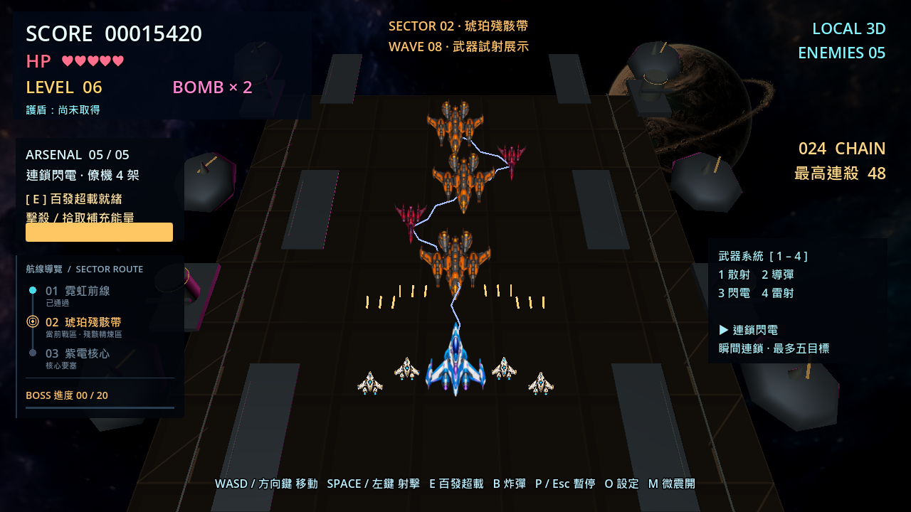

# Thunder Vector 3D — 開源跨裝置 3D 縱向射擊遊戲

> MIT 開源，Godot 4.7.2／GDScript。Windows 可離線執行；瀏覽器版面向電腦、手機和平板，首次下載後支援 PWA 離線快取。

## 直接遊玩

- [瀏覽器遊玩](https://avery-tse.github.io/thunder-vector-3d/index.html)：按「開始遊戲」，不用安裝 Godot。
- [Windows 下載與版本紀錄](https://github.com/Avery-TSE/thunder-vector-3d/releases)：下載 Windows ZIP、解壓後執行 `ThunderVector3D.exe`。
- [跨裝置操作與驗收範圍](docs/CROSS_DEVICE.md)：鍵盤／滑鼠、觸控搖桿、手把與離線限制。

手機／平板使用畫面外的搖桿和射擊鈕，可同時移動射擊；直向與橫向保持完整戰場。需要支援 WebGL 2／WebAssembly 的現代瀏覽器。尚未在所有實體 Android／iOS 裝置測試，不能承諾舊設備或每台手機的效能。首次完整下載前不能離線玩。



## 下載原始碼

公開專案：<https://github.com/Avery-TSE/thunder-vector-3d>

```powershell
git clone https://github.com/Avery-TSE/thunder-vector-3d.git
cd thunder-vector-3d
.\scripts\start_game.ps1
```

從原始碼啟動需要先安裝 Godot 4.7.2 Standard；一般玩家使用上方網頁或 Windows 下載即可。GitHub 頁面的 **Code → Download ZIP**
也能直接下載完整原始碼；`build/` 編譯產物不放進 Git 歷史。

這不是「智譜 API」。本套件使用的是**智慧圖譜／知識圖譜地圖**：`knowledge_graph/knowledge_graph.json` 是專案狀態來源，`smart_graph.png` 與 `smart_graph.svg` 是視覺連結圖。Codex 負責主程式修改，Ollama 地端模型透過 MCP 擔任規劃與審查者。

## 已完成內容

- 四種可切換主武器：散射機砲、四枚追蹤爆炸導彈、最多五目標連鎖閃電、雙束貫穿雷射；各模式保留僚機射擊。
- 擴大飛行與射擊畫面，可移動面積比前版增加約 89%；三戰區分別呈現軌道船塢、殘骸煉製區與晶體城塞，搭配原創透明行星與航線／BOSS 進度介面。
- 地圖裝飾使用固定共用資源，新武器使用預先建立的固定物件池；中央甲板保持低干擾，高建築位於飛行區外側。
- 百發超載：按 E 啟動 6 秒自動百發齊射，開場滿能量；期間暫時取代選中的主武器，結束後恢復所選模式。機砲模式五段成長至每輪 40 發。
- 原創透明僚機素材，開場 2 架、武器階級 3 解鎖 4 架；密集一擊雜兵、連殺與局部命中特效，M 可關閉震動；[玩法與驗收](docs/ARCADE_OVERDRIVE.md)。
- Godot 4.7.2、GDScript、GL Compatibility；Windows x86_64 原生版及單執行緒 WebGL 2 網頁版共用玩法。
- 手機觸控的移動／射擊分離指標，畫面外 48px+ 按鈕與可讀狀態列；切到其他 App 自動暫停，返回需按繼續。
- 手把左搖桿／十字鍵移動、A／右扳機射擊、B 炸彈、X 切武器、Y 超載、Start 暫停、Back 設定。
- 原創透明 ImageGen 玩家、四種敵機、BOSS 與四種道具主視覺；程序化 3D hull 保留為後備。
- 新增蛇行攔截機、三向彈幕轟炸機、四種編隊、三個戰區配色與星雲全景；[內容擴充與驗收紀錄](docs/CONTENT_EXPANSION.md)。
- 護盾道具可在 12 秒內抵擋一次傷害，重複拾取刷新時間；每局首架被擊落的攔截機保證掉落。
- WASD／方向鍵移動、Space／左鍵射擊、1–4 切換武器、B 炸彈、P／Esc 暫停、R／Enter 重開。
- 分數、血量、等級、道具、敵方彈幕、BOSS 戰、音效與 Game Over。
- O 鍵設定選單：主音量、音效、視窗／全螢幕、三種解析度與三段難度，退出後仍會保存。全新安裝預設 1600×900；既有玩家保留已儲存的解析度設定。
- 固定容量子彈／敵人物件池，以及 600 秒模擬壓力測試與 F3 診斷顯示。
- 爆炸／音效重用池、共享子彈網格、碰撞與 HUD 快取；[深度優化實測與取捨](docs/RUNTIME_OPTIMIZATION.md)。
- 原創透明 PNG、貼圖、8×8 爆炸精靈表、HUD 示意圖與 WAV 音效。
- 自動驗收戰鬥、四種道具、編隊、戰區、炸彈、BOSS、Game Over／重開、素材 alpha、設定持久化與 15 秒場景 smoke。
- Codex `AGENTS.md`、可貼上的命令、PowerShell 安裝／驗證／打包腳本。
- Ollama MCP Bridge：Codex 可呼叫地端模型規劃、審查檔案與檢查 git diff。
- 智慧圖譜 JSON、Mermaid、DOT、PNG 與 SVG。

## 武器操作

| 按鍵 | 主武器 | 特性 |
|---|---|---|
| 1 | 散射機砲 | 原有五階彈幕，持續壓制 |
| 2 | 追蹤導彈 | 每輪四枚，轉向追蹤並造成小範圍爆炸 |
| 3 | 連鎖閃電 | 瞬間連鎖最多五個不同目標 |
| 4 | 雙束雷射 | 兩條直線貫穿敵群，同一輪不會重複傷害同一敵人 |

按住 Space／滑鼠左鍵射擊。切換武器共用射擊冷卻，不會立即多送一輪攻擊；各模式均保留 2–4 架僚機。能量滿時按 E，暫時改為每輪最多 100 發的自動超載彈幕，包含僚機子彈；重新開始會回到機砲模式。

地圖、傷害規則、測試與量測限制見 [地圖與武器驗收](docs/MAPS_AND_WEAPONS.md)。

## Windows 發行狀態

來源庫不提交編譯產物。安裝官方 Godot 4.7.2 Export Templates 後，執行 `scripts/build_windows.ps1` 會先跑完整驗證，再建立 x86_64 PE、以匯出檔執行 headless／視窗雙 smoke，最後產生白名單 release ZIP。若 Windows 11 Smart App Control 阻擋未簽章的本機開發 EXE，腳本會失敗而不誤報；`-SkipLaunchValidation` 只供明確產生「尚未啟動驗證」的封包，狀態會寫入 `BUILD_INFO.txt`。

## 五分鐘開始

把資料夾解壓到簡短且可寫入的位置，例如：

```text
C:\Dev\ThunderVector3D
```

以一般 PowerShell 開啟該資料夾：

```powershell
Set-ExecutionPolicy -Scope Process Bypass
.\scripts\install_windows.ps1
```

重開 PowerShell，再執行：

```powershell
.\scripts\setup_ai.ps1 -OllamaModel "qwen3.5"
.\scripts\configure_codex_mcp.ps1 -OllamaModel "qwen3.5"
.\scripts\verify.ps1
.\scripts\start_game.ps1 -Editor
```

Godot 開啟後按 **F6 或 F5**。也可直接執行：

```powershell
.\scripts\start_game.ps1
```

Ollama 模型可能很大。硬體不足時，先用 `-SkipModelPull` 完成遊戲與 Codex 安裝，再自行選擇較小的本機模型。`OLLAMA_MODEL` 完全可替換，不影響遊戲執行。

## Codex × 地端模型協作

```powershell
.\scripts\run_codex.ps1
```

進入 Codex 後：

```text
/mcp
```

應看到 `thunder_local`。接著貼上：

```text
讀取 AGENTS.md 與 knowledge_graph/knowledge_graph.json。先用 thunder_local.plan_game_feature 規劃最高優先的未完成節點；我核准前不要修改。
```

核准後讓 Codex修改、執行驗證，再貼上：

```text
把 git diff 交給 thunder_local.review_change；修正所有 BLOCKER，重新驗證，只有在有真實命令結果時才更新智慧圖譜。
```

不使用 MCP 時，也能直接審查 diff：

```powershell
.\scripts\review_diff_local.ps1 -Task "檢查這次物件池修改是否造成射擊或碰撞回歸"
```

## 角色分工

| 角色 | 責任 | 不負責 |
|---|---|---|
| 你／製作人 | 決定玩法、核准範圍、實機感受 | 不必親自寫所有程式 |
| Codex | 讀專案、修改檔案、執行命令、修正問題 | 不得虛構測試結果 |
| Ollama 地端模型 | 規劃、第二意見、diff 與檔案審查 | 預設不直接修改檔案 |
| 智慧圖譜 | 保存節點狀態、依賴、下一任務與證據 | 不是模型 API |
| Godot | 本機 3D 渲染、物理、輸入、匯出 EXE | 不需要遊戲執行時連網 |

## 必裝與選裝程式

| 程式 | 用途 | 必要性 |
|---|---|---|
| Godot 4.7.2 Standard | 遊戲引擎、GDScript、Windows 匯出 | 必裝 |
| Git | 版本控制與 Codex 安全檢查點 | 必裝 |
| Node.js LTS | 安裝與執行 Codex CLI | 必裝 |
| Codex CLI | 主代理、修改與驗證專案 | 必裝（要 AI 協作時） |
| Python 3.10+ | MCP Bridge、驗證工具 | 必裝（要地端模型協作時） |
| Ollama | 執行地端模型 | 選裝但建議 |
| VS Code | 編輯 GDScript、Markdown、JSON | 建議 |
| Blender | 製作或修改正式 GLB 飛機模型 | 後期選裝 |

## 技能學習順序

1. Godot 編輯器：Scene、Node、Inspector、執行與 Remote Scene Tree。
2. GDScript：變數、函式、陣列、字典、訊號、生命週期。
3. 3D 基礎：座標、Transform、Camera3D、Mesh、Material、Light。
4. 遊戲機制：輸入、冷卻、敵人生成、碰撞、狀態與 UI。
5. 資源流程：PNG、WAV、GLB、匯入設定與授權紀錄。
6. 效能：物件池、Profiler、Draw Calls、節點數與配置抖動。
7. Git／Codex：小提交、明確驗收、測試證據、回滾。
8. 發布：Export Templates、版本資訊、乾淨電腦測試與壓縮發佈。

## 專案目錄

```text
ThunderVector3D_StarterKit/
├─ AGENTS.md
├─ README.md
├─ game/                         # 可直接匯入 Godot
│  ├─ project.godot
│  ├─ main.tscn
│  ├─ scripts/main.gd
│  └─ assets/                    # PNG、貼圖、爆炸、WAV
├─ knowledge_graph/              # 智慧圖譜 JSON／MMD／DOT／PNG／SVG
├─ prompts/                      # Codex 與地端模型指令
├─ tools/                        # MCP server、審查與驗證工具
├─ scripts/                      # Windows 安裝、設定、啟動、驗證、打包
├─ tasks/                        # 可逐張交給 Codex 的工作卡
├─ docs/                         # 開發規劃圖與說明
└─ reference_images/             # 素材總覽與視覺參考
```

## 驗證與打包

```powershell
.\scripts\verify.ps1
```

這會跑靜態檢查、Python 單元測試、Godot import/parser、設定、素材、完整玩法流程與固定 60 FPS 的 15 秒主場景 smoke。地圖與武器的專用測試位於 `game/tests/`；這些驗證不代表所有硬體的實際畫面幀率。腳本也能自動找到官方 WinGet 安裝但未加入 PATH 的 Godot 4.7.2。

在 Godot 選單安裝與 4.7.2 相符的 Export Templates，然後：

```powershell
.\scripts\build_windows.ps1 -OutputSubdirectory maps-weapons
```

地圖與武器版已輸出至獨立的 `build\maps-weapons\`，不覆蓋先前版本。已通過本機 EXE 啟動與 ZIP 驗證，完整來源 SHA、雜湊及限制見 [發行驗收紀錄](docs/MAPS_WEAPONS_RELEASE.md)。這次本機更新尚未推送 GitHub。

輸出位置：

```text
build\maps-weapons\ThunderVector3D.exe
build\maps-weapons\ThunderVector3D-1.0.0-windows-x86_64.zip
```

啟動已匯出的版本：

```powershell
.\build\maps-weapons\ThunderVector3D.exe
```

不帶 `-OutputSubdirectory` 時仍輸出至 `build\` 根目錄；`scripts/start_game.ps1 -Exported` 只會啟動根目錄中的匯出版本。

## 素材授權

本專案的程序化模型、原始 PNG／貼圖／WAV，以及十三張 ImageGen 素材（十二張透明、一張星雲背景）都是為本專案建立的原創內容；生成提示、SHA-256 與驗證記錄在 `game/assets/generated/` 的四份 `*ART_PROVENANCE.md`，包含新增行星的 `MAP_ART_PROVENANCE.md`。不要使用《雷電》原作商標、Logo、音樂、敵機圖或關卡素材；玩法可借鑑縱向射擊類型，但本專案維持自己的名稱與視覺識別。

## 授權

- 程式碼、腳本與專案文件採 [MIT License](LICENSE)。
- 原創遊戲素材採 [專案素材授權](LICENSE_ASSETS.txt)。
- Godot 引擎及其第三方元件聲明位於 `docs/licenses/`。

本專案是獨立原創的開源原型，與《雷電》系列或其他同名遊戲沒有關聯。
