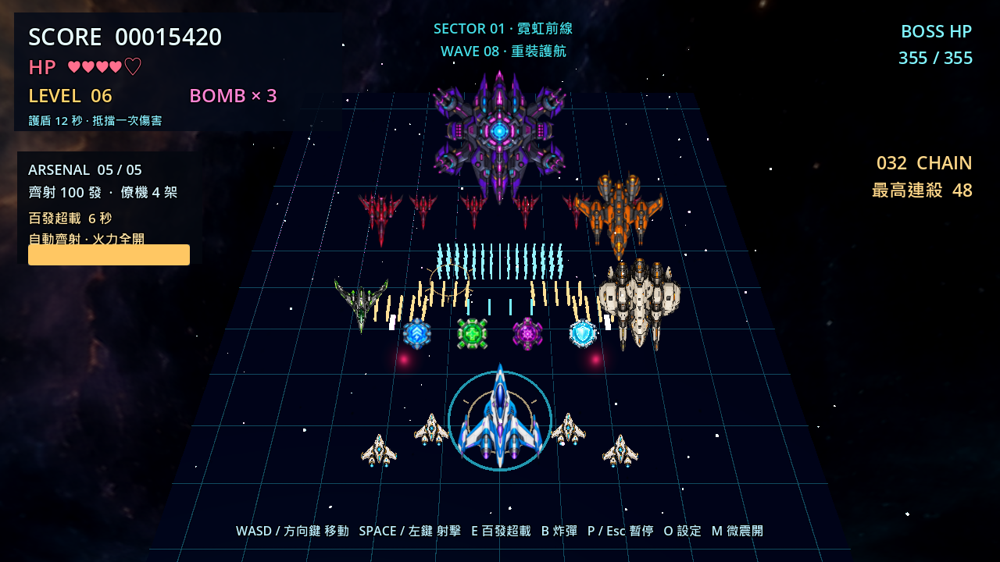

# 百發超載與僚機 — 2026-10-04

日期採用使用者端工作日期。離線 Godot 4.7.2／GL Compatibility；本次沒有推送 GitHub。

## 玩法

開場帶兩架原創透明 PNG 僚機。按住 Space／左鍵射擊；按 **E** 啟動已充滿的六秒超載，自動以約 0.2 秒間隔發射百發彈幕，**每輪實際 100 顆，包含僚機，不是每秒 100 顆**。超載後恢復普通射擊，需要再次充能。

| 武器階級 | 普通每輪總發數 | 僚機 | 超載每輪總發數 |
|---|---:|---:|---:|
| 1 | 10 | 2 | 100 |
| 2 | 14 | 2 | 100 |
| 3 | 24 | 4 | 100 |
| 4 | 32 | 4 | 100 |
| 5 | 40 | 4 | 100 |

所有敵人擊殺（含雜兵）每八架提高一階，最高五階；火力道具也提升一階，之後不會降階。雜兵不計入 BOSS 出場配額，避免大量弱敵讓 BOSS 過早連續出場。普通擊殺充能 5、雜兵 2.5、道具 10，最高 100；超載期間不充能。

新增每隊 8／10／12 架的一擊雜兵，不開火，逃出畫面不扣血，接觸仍有傷害。每次擊殺延長三秒連殺窗口；失去生命中斷連殺，護盾完整吸收傷害則保留。連殺目前是視覺成就，不額外增加傷害／倍率。BOSS 血量調整為 `320 + 已擊敗BOSS數 × 140 + 武器階級 × 35`。

主機青色、僚機金色彈幕，局部命中閃光、擴散環與火花；M 可切換輕微鏡頭震動，切換狀態只維持本次程式執行。原有 B 炸彈、P／Esc 暫停、O 設定、R／Enter 死亡後重開不變。暫停凍結遊戲計時與超載；重開恢復滿能量、兩架僚機、第一階火力。



展示腳本刻意同時陳列 BOSS、各類敵機與道具，不代表正常單一編隊。僚機生成提示、SHA-256、透明邊界證據見 `game/assets/generated/ARCADE_ART_PROVENANCE.md`。

## 實作與驗收標準

- 五階普通齊射和超載百發是真實可碰撞子彈，不是純特效。1024 顆玩家彈預熱池，一輪不足時完整等待，不產生半輪或誤記耗盡。
- 玩家彈使用一個 MultiMesh，移除逐顆燈光；渲染位置直接讀取碰撞節點，保留既有碰撞順序。保留 GL Compatibility。
- 敵方子彈／偵察機／重型機池為 128／64／16。出場預算另限雜兵 16、普通偵察機 12、共用 28、重型 5；物理容量也需預檢。
- 四架僚機預先建立重用，第二組只在階級 3 起顯示。24 槽命中特效、32 槽爆炸、16 音效聲部均有限重用。
- 暫停、到期、重複 E、死亡、重開、最後一幀獎勵、護盾／道具相容性須通過回歸；實際 GL 顯示與獨立 Windows 封包另驗證。

## 已執行驗證

`scripts/verify.ps1` exit 0：靜態檢查、5 項 Python 測試、Godot import/parser、所有原有回歸與 15 秒場景 smoke。新增 arsenal 18,886、feedback 983、combat 4,721、flow 372 項斷言通過。另明確執行 `godot --headless --path game --editor --quit` exit 0。Godot 必須是 4.7.2；PowerShell 驗證脚本可自動找 WinGet 安裝。

`game/tests/arcade_stress.gd`：600 **模擬秒**、36,000 個固定 60 Hz tick、75 輪「六秒超載＋兩秒普通」；2,100 次百發與 900 次普通四十發。測試才會定期補滿充能，不改正式玩法。四池容量固定，耗盡 0，353,070 項斷言通過。節點初始／重開均 3,332，抽樣 3,332–3,378；峰值在場玩家彈 340、敵彈 14、偵察機 19、重型 1。CPU tick 中位數 452 μs、p95 1,070 μs，**不含渲染，不是 FPS**。

原有 `scripts/stress_pool.ps1` 也通過 600 模擬秒，節點初始／重開 3,333，抽樣 3,341–3,364，四池無耗盡。

Windows 真實 GL 檢查 `game/tests/arcade_window_benchmark.gd`：RX 7600、1280×720、VSync 關、720 個實際渲染幀（120 暖機＋600 樣本），固定測試強制持續超載與 24 雜兵＋4 重型。此固定負載以測試方式補敵、靜音且不保存設定，並非自然出場配額。56 次百發齊射，峰值在場玩家彈 300、敵彈 12，池耗盡 0。

最終單次 post-draw 壁鐘間隔：中位數 1.673 ms、p95 2.363 ms、p99 2.854 ms、最大 3.728 ms。包含程序與渲染排程，不是純 GPU 時間，也不是一般遊玩／其他硬體 FPS 保證；較早量測曾有 101.577 ms 排程尖峰，未宣稱完全無抖動。

GL 數值讀回另在計時外核對：370 顆 → 非尾端回收後 246 顆 → 全回收 0 顆；位置最大誤差 0、顏色誤差 0.0003753 以內，全部順序／可見數量一致，沒有殘留。Headless dummy renderer 不能提供這項證據，所以獨立使用真實 Windows GL。官方展示 PNG 已重新擷取並人工檢視：透明邊緣、四僚機、密集彈幕及 HUD 無重疊。

重現額外檢查（`godot` 需已在 PATH，或改用已安裝 4.7.2 的絕對路徑）：

```powershell
godot --headless --path game --script res://tests/arcade_stress.gd
godot --path game --script res://tests/arcade_window_benchmark.gd
godot --path game --script res://tests/capture_arcade_preview.gd -- --output docs/screenshots/arcade_overdrive.png
```

## 對抗審查與剩餘限制

`thunder_local` 本次未提供可用工具，改採獨立 Codex 程式審查與使用者指定的 DashScope `qwen3.8-flash`。只傳必要 runtime diff，沒有密鑰、私人資料或整個專案；AI 完全不進遊戲 runtime。

独立審查發現一項 P2：雜兵占用普通 12 架預算，可能阻礙普通編隊與 BOSS 進度。已改為上列 16／12／28 分開限制，加入 41 項回歸；審查者重跑 flow 372、content 410、combat 4,721 後回覆 PASS。

Qwen 完成兩輪審查及一次窄範圍釐清：渲染一致性／狀態／暫停等疑慮已有測試；「雜兵不推進武器等級」與護盾執行流誤讀已依程式及測試撤回／修正，最終無具體技術 blocker。保留非阻塞限制：主觀切菜爽感、BOSS 時長與長期難度還需玩家實玩；離散碰撞非 swept collision，極限擦邊無連續碰撞保證；震動可關不代表所有光敏使用者皆適合。

Windows 封包、雜湊與啟動結果見 `ARCADE_RELEASE.md`；另一台乾淨 Windows 的相容性尚未測試。
