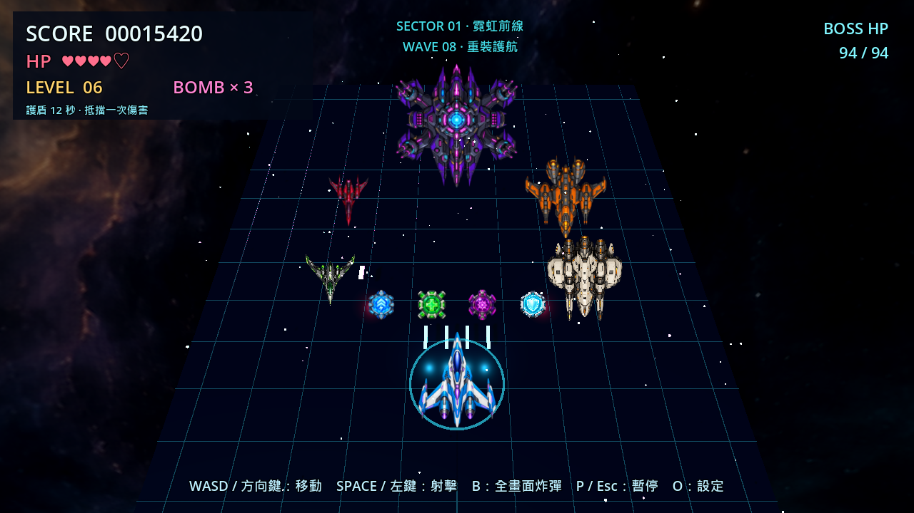

# 內容擴充版 — 2026-09-13

在既有離線 Godot 4.7.2／GL Compatibility 遊戲上新增內容，保留玩家、Scout、Heavy、BOSS、原道具與全部操作。本次不改公開 Git 歷史、不自動上傳；原版與 optimized 編譯檔保留。



## 新增內容

- 4 張原創 ImageGen 素材：攔截機、轟炸機、護盾的透明 RGBA PNG，以及一張 2:1 星雲背景。沿用原 7 張主視覺；新增 3 種戰區配色並非 3 張不同背景。來源、完整提示詞、SHA-256 與透明度驗證見 [素材紀錄](../game/assets/generated/CONTENT_ART_PROVENANCE.md)。
- 攔截機：快速蛇行，使用綠色細翼外觀；轟炸機：慢速厚裝甲、三向扇形彈幕，使用象牙色寬機身。與舊 Scout／Heavy 共用固定 32／16 個敵機池，釋放與再啟用時完整還原行為、數值與外觀。
- 四種波次依序輪替：巡邏先鋒、雙翼攔截、三角突擊、重裝護航。每波最多 3 架，間隔按數量補償；戰區改變編隊間距與搭配。池容量或場上預算不足時只保留一份待出場編隊，不生成半套編隊，也不累積佇列。
- 三戰區：霓虹前線 → 琥珀殘骸帶 → 紫電核心。擊敗 BOSS 才推進，第三區之後維持；改變網格／星光／HUD 色彩與同一張星雲的方向。升級火力不跳區，重開回第一區。
- 第四種道具「護盾」：拾取加 200 分、12 秒內抵擋一次完整傷害，觸發後有 0.45 秒緩衝。再拾取只刷新為 12 秒，不堆疊；暫停不扣秒，死亡／重开清除。每局首架被擊落的攔截機保證掉落，之後四種道具隨機掉落。護盾光環只有一份預建網格，不逐幀建立物件。

## 實際驗收

以 runtime checkpoint `5a8582f` 為本輪核心；重現命令：

```powershell
.\scripts\verify.ps1
.\scripts\stress_pool.ps1
.\scripts\build_windows.ps1 -OutputSubdirectory content
```

- 完整 `verify.ps1` exit 0：靜態驗證、5 個 Python 測試、Godot import／parser、舊設定／素材／戰鬥／FX／碰撞／HUD 測試、新編隊目錄 6864、內容整合 410、護盾 68 項斷言，以及 15 秒主場景 smoke 全部通過。
- 額外 `Godot --headless --path game --editor --quit` exit 0。
- `stress_pool.ps1` exit 0：36,000 幀固定 60 FPS 時步，即 600 秒模擬；初始／重開節點同為 1206，取樣範圍 1206–1223，子彈／敵機池固定為 96／128／32／16，無耗盡。
- Radeon RX 7600 的 Windows OpenGL Compatibility 真實渲染：1280×720 第一區與 1920×1080 第三區，畫面乾淨、HUD 無重疊、護盾與機體透明輪廓可辨。展示圖刻意排列全部物件，不代表正常波次同時出場或 FPS 壓測。
- 截圖工具曾因把道具 metadata `kind` 寫成 `type` 而報错；已修正，重新截圖 exit 0 且無 Godot 錯誤，未以先前誤印的 PASS 作驗收。
- 獨立 Codex 審查唯讀重跑 6864／410／68／325 項測試，PASS，未發現可重現 blocker。
- Windows 封包的實際結果與來源版本記在 `CONTENT_RELEASE.md`（打包後新增）及封包內 `BUILD_INFO.txt`，不以原始碼解析通過代替 EXE 啟動驗證。

## Qwen 雙輪審查與取捨

以使用者指定 `qwen3.8-flash` 完成兩輪，只傳送本輪必要的公開遊戲設計／程式差異與測試摘要；遊戲執行不包含模型或金鑰。地端 thunder_local MCP 本次不可用，未冒稱執行。

| Finding | Codex 決定與證據 | 第二輪結果 |
|---|---|---|
| TH-01 變體狀態殘留 | 接受為測試風險，實際欄位明確重設；410 項測試驗證同一 actor／sprite 還原。不存在模型假設的額外欄位。 | Resolved，無剩餘嚴重度；非已確認 bug |
| TH-02 編隊待出場死鎖 | 不採用 FIFO／丟棄舊波次；單一待出場計畫有容量恢復測試，Boss 由擊殺數獨立觸發。 | Withdrawn／Resolved |
| TH-03 護盾計時邊界 | 同步 physics 倒數，新增暫停、死亡、重開、致死同幀優先等 68 項斷言。 | Resolved，非已確認 bug |
| TH-04 戰區 GPU／資源 | 一張預載全景與同一組資源，只改色彩／方向；資源身分與節點壓測通過。 | 無邏輯缺陷；GPU 性能量測仍屬低優先後續 |
| TH-05 HUD 重疊 | 720p、1080p 實機截圖檢視，分數／戰區／BOSS／護盾資訊分區。 | Withdrawn／Resolved |

Qwen 第二輪沒有新 blocker；其 TH-04 validity 用語未完全遵循欄位枚舉，實質意見清楚，保留為「未量測 GPU 性能」而非將模型共識當性能證明。重試實際間隔為 0.25 秒，不採信回覆所稱「下一幀」。

## 邊界與後續

- 600 秒是 headless 模擬時長，不是持續 10 分鐘人工玩測，也沒有聲稱提升幾 FPS 或 GPU／VRAM 達標。
- 三區共享同一 BOSS 與背景；本次不是新增三套完整關卡，也未添加武器分支或劇情。
- 真實 Alpha 已測；攔截機與護盾極少邊緣像素有 1/255 透明度，低於既有 0.01 門檻。轟炸機完整不裁切，但上方空白約 5.2%，未達提示詞希望的 8%；詳見素材紀錄。
- 多人手感／長局平衡、獨立乾淨 Windows 電腦啟動與 GPU 幀時間量測仍待後續，不標作完成。
- 後續若需發佈，使用乾淨的公開分支工作流，不將包含早期參考素材的本機 main 歷史推上 GitHub。
