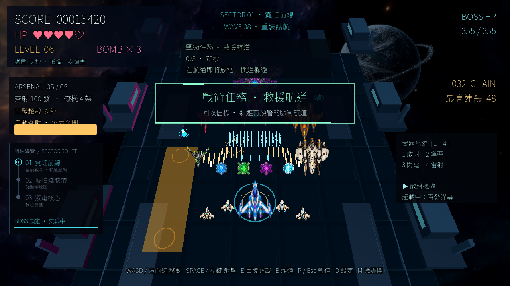

# v1.2.0 戰術任務與世界事件

本次沿用同一款 Godot 4.7.2／GL Compatibility 遊戲，不重寫主循環。新增循環任務、需要換道避開的脈衝航道、救援信標和戰鬥通知動畫；原有三戰區、四種主武器、2–4 架僚機與真正每輪 100 發超載保留。所有新內容離線運作，不呼叫 AI 或雲端服務。

## 任務

任務只計入當前目標生效後的實際事件。完成後等待 5 秒換下一個，逾時等待 3 秒換目標，不扣生命、不結束戰鬥。每次完成只領一次任務獎勵；充能僅在非超載期間加入，上限 100%。九項依序循環，不是九個劇情關卡。

| 任務 | 完成條件 | 時限 | 額外分數／充能 |
|---|---|---:|---:|
| 掃蕩先鋒 | 消滅 12 架敵機 | 40 秒 | 600／15% |
| 連殺王牌 | 達成 12 連殺，沿用 3 秒連殺間隔 | 45 秒 | 900／20% |
| 補給航線 | 收集 3 個補給 | 60 秒 | 750／25% |
| 百發時刻 | 成功啟動一次超載 | 45 秒 | 1,000／15% |
| 精英獵手 | 消滅 4 架攔截機或轟炸機，不含首領 | 60 秒 | 1,200／25% |
| 無傷穿越 | 連續 20 秒不損生命，損血重計 | 45 秒 | 1,000／25% |
| 三重火力 | 導彈、閃電、雷射各成功開火一次，切換不算 | 60 秒 | 1,500／30% |
| 救援航道 | 回收 3 個救援信標 | 75 秒 | 1,500／30% |
| 核心攻堅 | 擊破一次首領 | 90 秒 | 3,000／50% |

## 航道、救援與演出

- 左、中、右三條航道輪流預警；同時最多一條。黃色提示持續 2.2 秒，再轉成 1.6 秒紅色脈衝，換道躲避；每波最多判定一次傷害，既有護盾／無敵規則仍適用。
- 三枚原創程序化青色救援信標浮動、旋轉並帶脈動光環，從遠端往玩家飄移。每枚另外提供 125 分與 12% 充能；16 秒或越過邊界後消失，無限期留著等玩家不成立。
- 任務完成／逾時、超載啟動及首領登場有滑入、淡出、掃光邊框及時間條。新增世界事件固定 25 節點、3 個信標槽；通知使用預先建立的兩個文字節點，沒有每幀新建資源。
- 首領交戰時航道／信標隱藏並凍結，當前救援任務期限一起凍結，介面會說明；其他任務期限照常走。擊破首領後恢復。
- 暫停、設定與死亡不推進新事件／任務時間。重開清空進度、通知、事件及獎勵紀錄。受傷當幀不會反而被記成無傷時間，連殺失效會立即同步任務進度。
- 原鍵盤、滑鼠、觸控與手把操作不變。`M` 只控制既有震動選项，不能宣稱它關閉所有新動畫。

## 實際驗收

2026-10-04，根工作區與獨立審查者實際執行 `scripts/verify.ps1`，exit 0；另行 Godot `--headless --path game --editor --quit`，exit 0。

| 永久測試 | 真實結果 |
|---|---|
| `mission_director_test.gd` | 10,929 項斷言，200 輪／1,800 個獨立完成獎勵 |
| `world_events_test.gd` | 39,192 項斷言，600 秒模擬、固定節點／資源與實際 pause frame |
| `tactical_integration_test.gd` | 38 項整合斷言；實際擊殺、武器開火、100 發超載、收集、單波傷害、致死優先、pause/reset、首領救援 hold／恢復 |
| 既有驗收 | 49 項 Python 測試及原玩法／素材／設定／地圖／武器／觸控回歸、15 秒 smoke 全部通過 |
| 原生畫面 | 真 Windows／AMD RX 7600 GL Compatibility，1280×720 的新內容 capture exit 0，畫面已檢視 |

這張是驗收擺設場景，不是隨機遊玩截圖；為集中展示使用了首領、百發、僚機、信標與預警的同場擺設，正式玩法的首領期間世界事件仍暫停。沒有把截圖後製當成遊戲功能。

新版 Chrome WebGL 實測通過四尺寸 390×844、844×390、768×1024、1280×900 的 28 個布局條件：八按鈕、48px 下限、視口內／無溢出、16:9、任務可見與暫停凍結。可信雙指移動＋導彈射擊產生實際擊殺分數與任務進度；部分放開及取消清除操作，超載實際完成首項任務。斷網後從完成的 service-worker 快取重載、開玩並確認任務／分數重置通過。尺寸變更的第一次瞬時讀值曾尚未布局，捨棄該批結果，只記錄稳定後重測。小螢幕橫向戰場較小，不能把「不溢出」當作完美易讀或所有手機效能保證。

Windows／Web 套件及公開下載結果記錄在 [發行紀錄](TACTICAL_RELEASE.md)。新版 Windows 匯出成功但 EXE 被本機 CodeIntegrity 簽章政策阻擋，沒有 ZIP 或成功啟動證據；未由 headless 原始碼測試推論 EXE 可啟動。

## 獨立與 Qwen 審查

`thunder_local` 工具在本回合不可用；沒有宣稱它或 Ollama 已執行。Codex 子代理實際重跑完整測試並返回 PASS，修正了「受傷當幀錯算無傷」及「連殺過期仍顯示舊進度」兩個反例。

另有真實 DashScope 國際站 `qwen3.8-flash` 兩輪必要公開程式片段審查，工作 ID `thunder-tactical-missions-20261004`，第 2 輪版本 `tactical-v2-health-step-chain-sync-boss-rescue-hold-v1.2`；未傳金鑰或不相關專案資料，沒有換 Max 或購買額度。這是開發協作，不是切換 Codex 對話模型。

| Finding | Codex 核實與處置 | Qwen 第 2 輪／剩餘狀態 |
|---|---|---|
| INT-001，首領期間救援失效 | 「永遠卡住」不成立，槽會恢復移動並過期；接受暫藏仍耗時的公平性問題，凍結救援期限。實際首領 100 秒後恢复收集 3 枚完成 | confirmed／resolved／none |
| INT-002，重複任務獎勵 | phase guard、單調 serial 與清空事件佇列；38 項整合包含反覆 drain 不多發獎勵 | withdrawn／resolved／none |
| INT-003，手機布局 | 修正 96 是最低高度不是寬度的誤讀；審查後真 Chrome 四尺寸 28 條件、觸控戰鬥與離線重載通過，未再改 runtime | Qwen 回覆 confirmed／unresolved／low；後續實際 QA 由 Codex 核實關閉，沒有冒稱 Qwen 重測 |
| INT-004，座標／長時鐘 | 既有玩家 Z=0.5..10.2 與事件一致；約 694 天時鐘飽和是有測試的數值保護，不是一般遊玩失效 | withdrawn／resolved／none |
| INT-005，致死後領獎 | 事件傷害致死立即 return，清世界事件與通知；HP=1 的真場景測試抑制待領 600 分 | confirmed／resolved／none |

第 2 輪 `new_blockers` 為空；模型意見不能取代实測。保留的反方風險：平衡與任務節奏尚需真人長時間遊玩；大幅卡頓時採步末航道碰撞，不對已跨過的整個脈衝補傷害；未在所有實體手機、macOS、Linux 或另一台乾淨 Windows 驗證。可回退到保留的公開 v1.1.0，沒有覆蓋舊套件。
